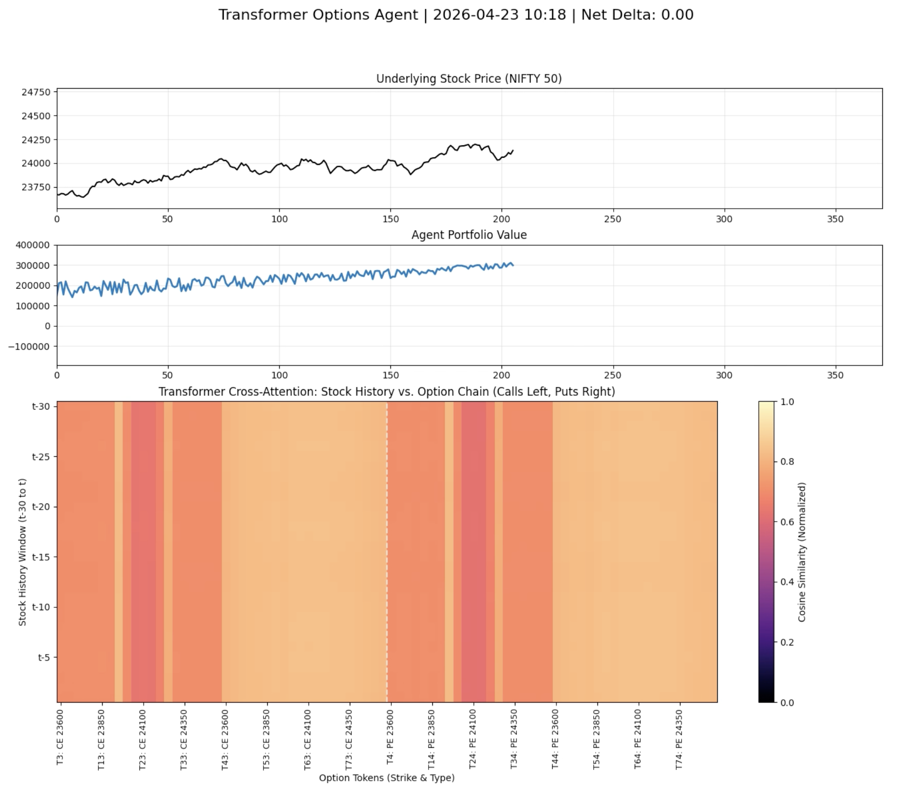

# Autoregressive Transformer for Options Trading

This project implements a sophisticated Reinforcement Learning (RL) agent that learns to trade financial options with the goal of maintaining a delta-neutral portfolio. The agent is built upon an encoder-decoder Transformer architecture and is trained using the Proximal Policy Optimization (PPO) algorithm.

The core of the project is its ability to autoregressively generate multi-leg option orders as a sequence of discrete tokens, allowing it to learn complex strategies like spreads and straddles.

### Agent Visualization

The following animation showcases the agent's decision-making process over a week of trading. It visualizes the agent's portfolio value, the underlying stock price, and, most importantly, the **Transformer's cross-attention mechanism**. The heatmap shows what parts of the stock's recent price history the model is "looking at" when considering which options to trade.




---

## Key Features

- **Autoregressive Action Generation:** The agent formulates trades as a sequence of tokens (e.g., `[SELL, STRIKE_450, 2_LOTS, BUY, STRIKE_460, 2_LOTS, EOS]`), enabling it to execute complex, multi-leg strategies.
- **Transformer-Based Policy:** An encoder-decoder Transformer model serves as the agent's brain, processing market data (stock history, option chain) and portfolio state to make decisions.
- **Delta-Neutral Strategy:** The agent is trained with a reward shaping mechanism that penalizes it for taking on excessive directional risk (delta), encouraging it to learn hedging strategies.
- **Custom RL Environment:** A custom `TradingEnv` simulates the market, option pricing (using Black-Scholes), and portfolio management, providing a realistic training ground.
- **Advanced Input Encoding:** The model's encoder receives a rich, composite sequence of the current portfolio state, the entire live option chain (80+ contracts), and 30 days of stock history, allowing it to capture complex market dynamics.
- **PPO Training:** The agent is trained using Proximal Policy Optimization (PPO), a state-of-the-art RL algorithm that provides stable and efficient learning.

## Core Concept: Delta-Neutrality via Reward Shaping

The primary goal of this agent is not just to maximize profit, but to do so while minimizing directional market risk. This is known as a **delta-neutral** strategy.

This is achieved through **reward shaping**. The raw reward at each step is the change in portfolio value (PnL). However, we introduce a penalty term proportional to the portfolio's net delta:

`shaped_reward = pnl_reward - (lambda * abs(net_delta))`

By penalizing the agent for high delta, the PPO algorithm learns to select trades that offset each other's directional exposure, naturally discovering strategies like spreads and straddles.

## Model Architecture

The model is an encoder-decoder Transformer designed for sequence generation.

#### Encoder
The encoder processes the complete state of the market and portfolio. Its input is a concatenated sequence of three parts:
1.  **`[CLS]` Token:** A special token whose embedding is enriched with a 7-dimensional summary of the portfolio (e.g., normalized balance, net delta, net vega, PnL). The value function head reads from this token's final output.
2.  **Option Chain (80 tokens):** A fixed-size representation of the available call and put options, each with 14 features (Greeks, price, moneyness, etc.).
3.  **Stock History (30 tokens):** A sequence representing the last 30 periods of the underlying asset's price data (OHLCV and technical indicators).

This combined sequence of 111 tokens is processed by the encoder, creating a rich, contextual memory representation.

#### Decoder
The decoder is autoregressive. At each step, it attends to the encoder's memory and the sequence of trade tokens generated so far to predict the next token in the sequence. This allows it to build a trade one piece at a time (Action -> Strike -> Lots).

## Backtest Performance

The following chart from a backtest episode shows the agent's equity curve against its net delta exposure over time. The agent successfully grows the portfolio while keeping the net delta oscillating around zero, demonstrating the effectiveness of the delta-neutral strategy.


## Project Structure

```
options-trading-seq2seq-rl/
├── src/
│   ├── env/
│   │   └── trading_env.py      # Custom OpenAI-gym-like environment
│   ├── models/
│   │   └── transformer.py      # AutoregressiveTradeModel definition
│   ├── docs/
│   │   └── Paper.pdf           # Academic research paper
│   ├── utils/
│   │   ├── Option.py           # Black-Scholes option pricing
│   │   ├── OptionChain.py      # Option chain generation
│   │   └── generate_options_data.py # Pre-computation script for training data
│   ├── test/
│   │   ├── backtest.py         # Runs evaluation and plots results
│   │   └── backtest_gen_video.py # Generates the attention heatmap video
│   └── train_rl_delta_neutral.py # Main PPO training script
├── assets/                     # Visualizations and results
│   ├── agent_2D_heatmap.gif
│   ├── agent_2D_heatmap.mp4
│   └── test_result.png
└── README.md
```

## How to Run

1.  **Setup:**
    Install the required dependencies. It's recommended to use a virtual environment.
    ```bash
    pip install -r requirements.txt
    ```

2.  **Generate Dummy Data (Optional):**
    If you don't have NIFTY50 data, the script can generate a dummy dataset.
    ```bash
    python src/utils/generate_options_data.py
    ```

3.  **Train the Agent:**
    Start the PPO training process. The model and training logs will be saved in the `src` directory.
    ```bash
    python src/train_rl_delta_neutral.py
    ```

4.  **Evaluate the Agent:**
    Run a deterministic backtest using the best-saved model and generate a performance plot.
    ```bash
    python -m src.test.backtest
    ```

5.  **Create Visualization Video:**
    Generate the attention heatmap video from a new simulation run.
    ```bash
    python -m src.test.backtest_gen_video
    ```
